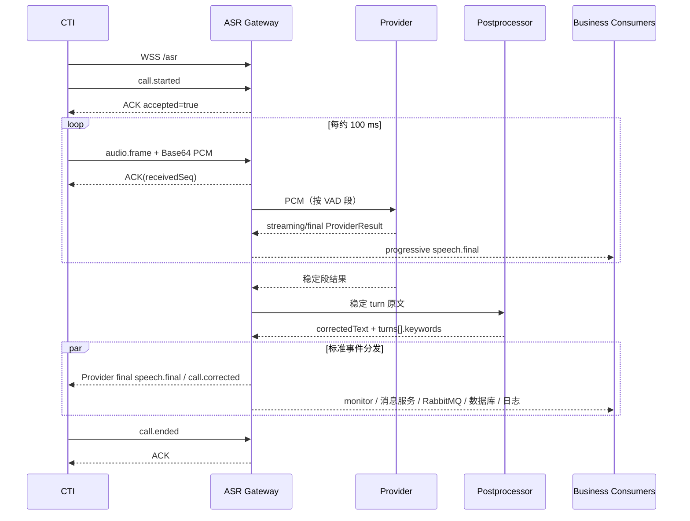

# ASR 全链路技术交接与服务商对接协议

版本：v1.0
编写日期：2026-07-27
适用环境：`192.168.173.167`
代码目录：`/home/twai/huilong/full_question_v6_strata/asr_api_use`

> 本文档是当前 ASR 系统的交接主文档。协议、端口和行为以当前代码为准；历史 README
> 中“先发送 `is_speaking`，再直接发送二进制 PCM”的方式是旧版麦克风/FunASR 直连协议，
> **不是 CTI 生产接入协议**。当前 `/asr` 的首条消息必须是带 `eventType` 的 Bridge JSON。

## 1. 文档范围与稳定边界

本文覆盖从 CTI 双路音频接入，到 ASR 原始识别、VAD 分段、模型切换、地址纠错、规则
高亮、录音、结果分发、落库、日志和运维的完整链路，并定义后续更换 ASR 服务商时必须
保持不变的协议。

稳定边界如下：

1. CTI 继续使用本文第 5 章的 Bridge 事件协议，不感知底层模型厂商。
2. 业务端继续消费 `speech.final`、`audio.segment` 和 `call.corrected`。
3. `provider`、`providers` 可以反映实际识别来源，但不得改变公共事件结构。
4. ASR Provider 只产出原始转写文本；`correctedText` 由统一后处理产生。
5. 地址库确定性纠错负责改写 `correctedText`；规则只提取高亮关键词，不再改写文本。
6. 真实密码、API Key、Secret、Token、证书私钥不得写入代码、Git、diff、文档或日志。

## 2. 当前生产链路概览

```mermaid
flowchart LR
    CTI[CTI 双路语音流] -->|WSS /asr\nBridge JSON + Base64 PCM| GW[HTTPS/WSS 网关 :8443]
    GW --> PAIR[双路会话配对\nagent + caller]
    PAIR --> PRE[连续性检查/增益/VAD]
    PRE --> PF[GPU FunASR\nContextualParaformer :10099]
    PRE --> XF[科大讯飞\n方言识别 WebAPI]
    PF --> TURN[稳定 Turn]
    XF --> TURN
    TURN --> DBALIGN[地址库拼音对齐纠错]
    DBALIGN --> RULE[规则提取高亮关键词]
    RULE --> OUT[标准业务事件]
    OUT --> CTIOUT[原 CTI WebSocket]
    OUT --> MON[/monitor]
    OUT --> MSG[消息服务]
    OUT --> MQ[RabbitMQ ids:qs]
    OUT --> PG[PostgreSQL]
    OUT --> LOG[业务日志]
    PRE --> REC[本地录音 + 录音 OpenAPI]
    REC --> OUT
```

当前默认链路：

```text
CTI audio.frame
  → 16 kHz / 16 bit / 单声道 PCM
  → VAD 切段
  → GPU ContextualParaformer（默认）或科大讯飞（人工切换）
  → 稳定 turn
  → 地址库拼音对齐纠错
  → 保持 correctedText
  → 规则提取 turns[].keywords
  → 推送 call.corrected
```

同一通电话通常不是一个 WebSocket：坐席侧和来电侧各建立一条连接、各有一个 `callId`。
两路通过 `(project, callfrom, callto)` 配对。展示、切换和故障排查时必须同时关注两个
`callId`，不能只看其中一路。

## 3. 当前环境资产

### 3.1 地址、端口和进程

| 组件 | 当前地址/名称 | 用途 |
| --- | --- | --- |
| 生产网关 | `https://192.168.173.167:8443` | HTTPS/WSS、控制接口、监控页 |
| 生产 ASR | `wss://192.168.173.167:8443/asr` | CTI 全链路入口 |
| 域名入口 | `wss://sqasr.telewave.com.cn:8443/asr` | 已在脚本中配置的域名口径 |
| 监控页 | `https://192.168.173.167:8443/monitor.html` | 实时事件与模型状态 |
| GPU FunASR | `ws://192.168.173.167:10099` | 生产 ContextualParaformer |
| CPU FunASR | `ws://192.168.173.167:10097` | CPU 全链路测试上游 |
| CPU 测试入口 | `wss://192.168.173.167:8443/asr-cpu-test` | 仅用于 CPU 测试 |
| GPU 容器 | `funasr-paraformer-large-gpu` | 生产 FunASR |
| CPU 容器 | `funasr-paraformer-large` | CPU 测试 FunASR |
| 科大讯飞 | `wss://iat.cn-huabei-1.xf-yun.com/v1` | 方言识别大模型 WebAPI |

### 3.2 关键代码

| 文件 | 职责 |
| --- | --- |
| `https_gateway.py` | TLS 网关、路由、Bridge 首帧识别、模型切换和 CTI 控制接口 |
| `asr_bridge.py` | 会话、ACK、双路配对、VAD、识别、结果归一化和事件扇出 |
| `asr_providers.py` | FunASR、科大讯飞 Provider 及工厂 |
| `asr_ai_postprocessor.py` | 地址库拼音对齐纠错和规则高亮 |
| `hotword_manager.py` | 热词文件选择、阶段和会话缓存 |
| `asr_message_service.py` | UAC 登录及消息服务推送 |
| `asr_rabbitmq.py` | RabbitMQ CloudEvent 发布 |
| `asr_database.py` | ASR 文本与录音地址落库、查询 |
| `funasr_server_xhw.py` | 自定义 FunASR 服务端及热词传入 |
| `start_all_services.sh` | GPU、CPU 容器和网关统一启动 |
| `watchdog.sh` | 服务守护与自动恢复 |
| `generate_full_hotwords.py` | 从分项热词生成 `hotwords_full/full.txt` |

### 3.3 当前非敏感运行开关

以下是当前部署口径，不包含密钥值：

```dotenv
ASR_XFYUN_ENABLED=true
ASR_UPSTREAM_WS=ws://192.168.173.167:10099
ASR_CPU_TEST_UPSTREAM_WS=ws://192.168.173.167:10097
GATEWAY_HOST=0.0.0.0
GATEWAY_PORT=8443
ASR_RECORDING_STORE=openapi
ASR_RABBITMQ_ENABLED=false
ASR_RABBITMQ_QS_ENABLED=true
ASR_AI_CORRECTION_ENABLED=true
ASR_CORRECTION_PROVIDER=db_align
ASR_HIGHLIGHT_PROVIDER=rule
ASR_ADDRESS_DB_ENABLED=true
ASR_DB_ENABLED=true
ASR_MESSAGE_ENABLED=true
```

密钥交接必须通过受控密码系统完成，至少包括：TLS 证书私钥、科大讯飞凭据、数据库
凭据、UAC/消息服务凭据、RabbitMQ 凭据和录音 OpenAPI 凭据。

## 4. 会话模型与端到端时序

### 4.1 双路会话模型

建议的角色定义：

| 角色 | `speaker` | `direction` | 常见含义 |
| --- | --- | --- | --- |
| 坐席路 | `agent` | `outbound` | 坐席说话的音频流 |
| 来电路 | `caller` | `inbound` | 来电人说话的音频流 |

每路使用独立 `callId`，但 `project`、`callfrom`、`callto` 相同。系统用三元组
`(project, callfrom, callto)` 找到对路连接。模型切换时任意一路 `callId` 都可作为锚点，
网关会同时切换两路。

### 4.2 正常时序



### 4.3 生命周期要求

1. CTI 先连接 WSS，再发送 `call.started`。
2. `audio.frame.seq` 在单路连接中单调递增；时间戳也应连续。
3. 音频按真实速度发送，推荐每 100 ms 一帧。
4. 挂断时发送 `call.ended`，等待 ACK 后关闭连接。
5. 网络断开后不能假设服务端保留未确认音频；重连应建立新连接并重新发送
   `call.started`。当前协议不提供 exactly-once 音频重放。
6. 消费端以 `eventId` 或 `callId + segmentId` 做业务幂等。

## 5. CTI WebSocket 输入协议

### 5.1 连接要求

- 生产地址：`wss://192.168.173.167:8443/asr`。
- TLS 证书应由调用方信任；测试时可临时忽略自签名校验，生产不建议。
- 每条物理音频流一条 WebSocket。
- 首条业务消息必须是包含 `eventType` 的文本 JSON。
- 音频放在 `audio.frame.payload.audioBase64`，不要向 `/asr` 直接发送裸二进制。
- `project` 推荐明确传入；地址项目别名会归一化为 `addressbot`，其他值归一化为
  `firebot`。

### 5.2 公共事件结构

```json
{
  "eventId": "evt-agent-start-0001",
  "eventType": "call.started",
  "callId": "agent-stream-call-id",
  "seq": 0,
  "eventTime": 1784799000000,
  "project": "firebot",
  "callfrom": "13800000000",
  "callto": "8012",
  "payload": {}
}
```

| 字段 | 必填 | 说明 |
| --- | --- | --- |
| `eventId` | 推荐 | 全局事件幂等键 |
| `eventType` | 是 | 事件类型 |
| `callId` | 是 | 当前物理音频流的唯一 ID |
| `seq` | 音频必填 | 单路递增序号 |
| `eventTime` | 是 | 毫秒时间戳 |
| `project` | 推荐 | `firebot` 或 `addressbot` |
| `callfrom` | 推荐 | 主叫号码；音频帧中还会再次提供 |
| `callto` | 推荐 | 被叫/坐席号；模型切换的 `seatId` 应与此一致 |
| `payload` | 是 | 事件负载 |

### 5.3 `call.started`

发送方：CTI；接收方：ASR 网关。必须作为连接的第一条业务事件。

```json
{
  "eventId": "evt-agent-start-0001",
  "eventType": "call.started",
  "callId": "agent-stream-call-id",
  "seq": 0,
  "eventTime": 1784799000000,
  "project": "firebot",
  "callfrom": "13800000000",
  "callto": "8012",
  "payload": {
    "speaker": "agent",
    "direction": "outbound"
  }
}
```

来电侧另开一条连接，并使用另一个 `callId`：

```json
{
  "eventId": "evt-caller-start-0001",
  "eventType": "call.started",
  "callId": "caller-stream-call-id",
  "seq": 0,
  "eventTime": 1784799000000,
  "project": "firebot",
  "callfrom": "13800000000",
  "callto": "8012",
  "payload": {
    "speaker": "caller",
    "direction": "inbound"
  }
}
```

### 5.4 `audio.frame`

音频格式固定为 16 kHz、16 bit、有符号小端、单声道 PCM。推荐 100 ms/帧，即每帧
3200 字节原始 PCM，再进行 Base64 编码。

```json
{
  "eventId": "evt-agent-audio-0001",
  "eventType": "audio.frame",
  "callId": "agent-stream-call-id",
  "seq": 1,
  "eventTime": 1784799000100,
  "project": "firebot",
  "payload": {
    "speaker": "agent",
    "direction": "outbound",
    "callfrom": "13800000000",
    "callto": "8012",
    "startTimeMs": 1784799000000,
    "endTimeMs": 1784799000100,
    "codec": "pcm_s16le",
    "sampleRate": 16000,
    "channels": 1,
    "audioBase64": "<BASE64_PCM>"
  }
}
```

CTI 必须以实时节奏推送，不要瞬间灌入整段文件。`speaker`、`direction` 和号码字段必须
在整条连接中保持一致。Bridge 会以音频帧中的号码更新最终配对元数据，因此这些字段
不能省略或传错。

### 5.5 `call.ended`

```json
{
  "eventId": "evt-agent-end-0001",
  "eventType": "call.ended",
  "callId": "agent-stream-call-id",
  "seq": 501,
  "eventTime": 1784799050000,
  "project": "firebot",
  "payload": {
    "reason": "normal"
  }
}
```

双路应分别发送 `call.ended`。如果异常断线，服务端会清理该连接，但可能缺少最后一个
VAD 段和最终录音绑定，因此 CTI 应尽量完成正常结束流程。

### 5.6 心跳与兼容事件

- `heartbeat`：连接保活；仍应携带 `callId`、`eventTime` 和 `payload`。
- `stage.changed`：切换业务阶段热词，兼容旧业务调用。
- `asr.hotwords.switch`：显式切换热词阶段，兼容旧业务调用。

当前网关对未知 `eventType` 可能返回成功 ACK，但这只是兼容行为，调用方不得据此认为
未知事件已被业务处理。

### 5.7 ACK

```json
{
  "type": "ack",
  "callId": "agent-stream-call-id",
  "callfrom": "13800000000",
  "callto": "8012",
  "receivedSeq": 1,
  "accepted": true,
  "message": "OK"
}
```

| 字段 | 说明 |
| --- | --- |
| `receivedSeq` | 已处理的输入序号；控制事件可能为空或对应其序号 |
| `accepted` | 网关是否接受该输入 |
| `message` | `OK`、`CALL_HELD` 或错误原因 |

保持期间音频帧会返回 `accepted=true`、`message=CALL_HELD`，但不会进入识别。常见拒绝
原因包括 `BRIDGE_PROTOCOL_REQUIRED`、`MISSING_REQUIRED_FIELD`、`INVALID_JSON` 和
`ASR upstream unavailable`。


## 6. 控制面协议

### 6.1 通话保持与恢复：`POST /cti/events`

请求地址：`https://192.168.173.167:8443/cti/events`。

~~~json
{
  "eventId": "hold-event-0001",
  "eventType": "localHoldCall",
  "callId": "agent-stream-call-id",
  "eventTime": 1784799010000,
  "ext": {
    "from": "13800000000",
    "to": "8012",
    "extId": "8012",
    "callerId": "13800000000"
  }
}
~~~

恢复时只把 `eventType` 改为 `callHoldCancel`，使用新的 `eventId`。系统既按 `callId`
也按主被叫号码对维护保持状态，因此命中任意一路后会暂停/恢复同一电话的两路音频。
重复 `eventId` 会被忽略，调用方应为每次业务动作生成唯一 ID。

### 6.2 双路模型切换：`POST /asr/model/switch`

请求地址：`https://192.168.173.167:8443/asr/model/switch`。

~~~json
{
  "callId": "caller-stream-call-id",
  "model": "xfyun",
  "seatId": "8012"
}
~~~

| 字段 | 必填 | 说明 |
| --- | --- | --- |
| `callId` | 是 | 坐席路或来电路任意一个真实流 ID |
| `model` | 是 | 当前支持 `funasr`、`xfyun` |
| `seatId` | 是 | 必须与该通电话的 `callto` 一致 |

切回 GPU Paraformer：

~~~json
{
  "callId": "agent-stream-call-id",
  "model": "funasr",
  "seatId": "8012"
}
~~~

统一返回体固定为五个顶层字段：

~~~json
{
  "success": true,
  "message": "操作成功！",
  "code": 200,
  "data": {
    "requestId": "44fdf4d3683a4d6fbd0417971b79f866",
    "callIds": [
      "agent-stream-call-id",
      "caller-stream-call-id"
    ],
    "model": "xfyun"
  },
  "timestamp": 1784799012345
}
~~~

业务失败也统一返回 HTTP 200，并保持 `code=200`：

~~~json
{
  "success": false,
  "message": "CALL_NOT_FOUND",
  "code": 200,
  "data": {
    "requestId": "44fdf4d3683a4d6fbd0417971b79f866"
  },
  "timestamp": 1784799012345
}
~~~

只有未捕获的服务端异常才使用 HTTP 500、`code=500`。因此前端不能只看 HTTP 状态码，
至少要检查 `success`、`message` 和 `data.requestId`。

### 6.3 模型切换的最终状态

接口成功仅代表两路会话接受了异步切换请求，不代表新供应商已经连通。最终状态只从
`/monitor` 的以下事件判断；原 CTI 音频 WebSocket 不接收模型状态事件：

| 事件 | 含义 |
| --- | --- |
| `asr.model.state` | 当前、待切换及可用 Provider 状态 |
| `asr.model.switch.pending` | 已接受请求，正在建立新 Provider |
| `asr.model.changed` | 指定 `requestId` 已实际生效 |
| `asr.model.switch.failed` | 指定 `requestId` 切换失败或发生回退 |

典型生效事件：

~~~json
{
  "event": "asr.model.changed",
  "callId": "agent-stream-call-id",
  "currentProvider": "xfyun",
  "pendingProvider": null,
  "targetProvider": "xfyun",
  "requestId": "44fdf4d3683a4d6fbd0417971b79f866",
  "effective": "immediate",
  "availableProviders": ["funasr", "xfyun"],
  "connectElapsedMs": 1260,
  "bufferedAudioMs": 700
}
~~~

前端应以同一 `requestId` 等待两个 `callId` 都收到 `asr.model.changed`。只收到一路成功时，
应显示“双路模型不一致”，不能显示整通电话已切换成功。切换采用立即切段并连接的方式，
不等待 VAD；建连期间缓存音频。当前默认切换超时约 15 秒，缓存上限约 20 秒。正常耗时
主要取决于供应商建连，科大讯飞通常不是零等待。

科大讯飞在切换成功后，如果某一个语音段调用失败，该段会回放给 FunASR 兜底；这不等于
整条连接已自动切回，`currentProvider` 仍可能是 `xfyun`，下一段会继续尝试科大讯飞。

常见业务错误：

| `message`/错误码 | 处理建议 |
| --- | --- |
| `INVALID_JSON` | 检查请求体是否为 JSON |
| `INVALID_MODEL_SWITCH_REQUEST` | 检查三个必填字段和模型枚举 |
| `CALL_NOT_FOUND` | 确认真实通话已建立且 `callId` 无误 |
| `CALL_ID_NOT_SWITCHABLE_STREAM` | 该连接不是可切换的 agent/caller 音频流 |
| `SEAT_ID_MISMATCH` | `seatId` 与本通电话 `callto` 不一致 |
| `PAIRED_STREAM_NOT_FOUND` | 另一条音频流尚未连接或配对字段错误 |
| `PAIRED_STREAM_AMBIGUOUS` | 同一配对键存在多条候选连接，检查 CTI 元数据 |
| `MODEL_SWITCH_IN_PROGRESS` | 已有切换进行中，等待最终状态后重试 |
| `XFYUN_DISABLED` | 检查功能开关 |
| `XFYUN_CREDENTIALS_MISSING` | 检查密钥是否通过环境变量注入 |
| `XFYUN_CLIENT_UNAVAILABLE` | 依赖、网络或 Provider 初始化失败 |
| `PAIRED_MODEL_SWITCH_REJECTED` | 两路中至少一路拒绝，结合状态事件和日志定位 |

## 7. ASR Provider 内部适配协议

### 7.1 统一输入输出

Provider 以一个 VAD 段为生命周期单位，统一接收：

- `segment_id`：网关生成的段 ID；
- PCM：16 kHz、16 bit、有符号小端、单声道；
- `hotwords`：本段热词字符串，可为空；
- 音频块顺序必须保持不变。

统一结果对象：

~~~text
ProviderResult(
  provider,
  segment_id,
  text="",
  is_final=False,
  mode="streaming",
  error_code="",
  error_message="",
  sid=""
)
~~~

| 字段 | 要求 |
| --- | --- |
| `provider` | 稳定的供应商短名，例如 `funasr`、`xfyun` |
| `segment_id` | 原样返回网关分配的段 ID |
| `text` | 已完成供应商专有增量合并和控制符清理的文本 |
| `is_final` | 本段是否结束 |
| `mode` | 归一化为 `streaming` 等网关可识别模式 |
| `error_code` | 空串表示无错误；失败时使用稳定、可监控的错误码 |
| `error_message` | 可读且脱敏，绝不包含鉴权 URL、Secret 或 Token |
| `sid` | 供应商会话 ID，可用于供应商侧排查 |

### 7.2 Provider 实例接口

新 Provider 必须实现与现有适配层等价的异步生命周期：

~~~python
class AsrProvider:
    name: str
    segment_id: str

    async def start(self) -> None: ...
    async def send_audio(self, pcm: bytes) -> None: ...
    async def finish(self) -> None: ...
    def events(self): ...
    async def close(self) -> None: ...
~~~

- `start()`：完成鉴权、建连和首帧参数发送；失败转成稳定 Provider 错误。
- `send_audio()`：发送当前段 PCM，不得阻塞整个网关事件循环。
- `finish()`：发送结束帧，让供应商输出最终结果。
- `events()`：异步产生 `ProviderResult`，正确处理增量、替换和最终帧。
- `close()`：幂等释放连接、任务和缓存；异常路径也必须可调用。

### 7.3 Provider 工厂接口

工厂必须提供：

~~~python
availability(provider_name)
available_providers()
await create(provider_name, segment_id, hotwords="")
await close_unused(...)
~~~

`availability` 应区分功能未启用、缺少凭据、客户端依赖不可用和可用。`create` 只接收
统一参数，供应商自己的鉴权参数从环境变量读取。不得把厂商参数继续传到 CTI 请求体中。

### 7.4 当前 FunASR 适配

默认 Provider 名称为 `funasr`，实际连接 GPU ContextualParaformer `:10099`。每段启动
握手包含以下语义：

~~~json
{
  "chunk_size": [5, 10, 5],
  "wav_name": "callId__segmentId",
  "is_speaking": true,
  "chunk_interval": 10,
  "mode": "2pass",
  "itn": true,
  "language": "auto",
  "hotwords": "<HOTWORDS_JSON_OR_TEXT>"
}
~~~

随后发送二进制 PCM，段尾发送 `is_speaking=false`。注意这是**网关到 FunASR 上游**的
内部协议，不是 CTI 到网关的外部协议。自定义服务端将热词传给
`model.generate(hotword=...)`。上游目前总是返回 `mode=streaming`，Bridge 不仅依赖上游
`is_final`，还结合段生命周期形成稳定 turn。

### 7.5 当前科大讯飞适配

Provider 名称为 `xfyun`，当前 WebAPI 参数口径：

~~~text
endpoint=wss://iat.cn-huabei-1.xf-yun.com/v1
language=zh_cn
accent=mulacc
domain=slm
dwa=wpgs
~~~

适配器按约 40 ms 发送音频，使用状态 `0/1/2` 表示首帧、中间帧和末帧，并处理
`wpgs` 动态修订结果。单段最大时长默认约 55 秒。

`accent=mulacc` 表示多口音/方言识别能力，不等于把贵州话或粤语语义自动改写为标准
普通话表达。当前适配层只清理厂商控制 token 和空格，没有方言语义改写。如果业务确实
需要“方言表达 → 标准普通话表达”，应新增独立的方言规范化阶段或采用明确支持该能力的
服务，而不能复用地址纠错代替。

当前科大讯飞适配器没有注入项目热词。更换或升级科大讯飞能力时，必须先确认目标产品
是否支持热词、热词格式、额度和生效范围，再在 Provider 内转换，不能修改 CTI 协议。

## 8. 热词管理

### 8.1 当前行为

- 默认使用全量模式，文件为 `hotwords_full/full.txt`。
- 分项源文件包括 `hotwords/address.txt` 以及问询、高层、人员密集、化工、电梯等阶段。
- 全量模式下，阶段切换仍保留完整热词表。
- `HotwordManager` 按会话缓存读取结果；已建立会话不会自动重新加载修改后的文件。
- 热词当前只传入 FunASR，科大讯飞链路不加载项目热词。

### 8.2 修改和生效步骤

只修改 `hotwords/address.txt` 不会自动更新生产使用的 `full.txt`。修改后执行：

~~~bash
cd /home/twai/huilong/full_question_v6_strata/asr_api_use
python3 generate_full_hotwords.py
~~~

随后检查生成结果并让新会话生效。为了避免会话缓存和进程内状态不一致，生产变更建议在
无通话窗口重启服务；至少必须使用新建通话验证 Provider 启动日志中热词数量和目标词。
不要在有通话时运行统一重启脚本。

## 9. 音频预处理、VAD 和分段

### 9.1 当前参数口径

音频预处理检查 `seq`、时间戳连续性并进行有界增益；当前 VAD 使用原始音频。主要参数：

~~~dotenv
ASR_VAD_USE_RAW_AUDIO=true
ASR_VAD_AGGRESSIVENESS=3
ASR_VAD_SPEECH_CONFIRM_FRAMES=4
ASR_VAD_SILENCE_CONFIRM_MS=1300
ASR_VAD_MIN_SPEECH_MS=500
ASR_VAD_ENERGY_SILENCE_DB=-42
~~~

参数名应以实际 `.env.example` 和代码为准；调整前必须用真实双路通话回归。静音阈值和
尾部静音会同时影响切段延迟、短句漏识别、长句断开和供应商单段限制，不能只看某一个
样本修改。

### 9.2 Segment 与 Turn

- `segmentId`：一次 VAD 音频段的 ID，对应 Provider 调用和录音段。
- `segmentIds`：一个稳定 turn 可能合并的多个段 ID。
- progressive 文本：识别过程中的临时结果，可被后续结果替换。
- stable turn：Bridge 判定可供业务持久化和后处理的最终文本。

业务端必须用 `segmentIds` 关联稳定文本、纠错结果和录音，不要用到达顺序强行绑定。

## 10. 地址纠错与规则高亮

### 10.1 固定处理顺序

当前生产后处理链路固定为：

~~~text
ASR 原文
  → PostgreSQL 地址库候选
  → 拼音对齐确定性纠错
  → 生成 correctedText 和 replacements
  → 规则只从 correctedText 提取高亮关键词
  → 保持 correctedText 不再变化
  → 推送 call.corrected
~~~

规则会结合地址词、事故词、楼栋/楼层/房号结构以及“我在……小区”等上下文提取关键词。
这一步是本地计算，不调用 LLM。后续如重新启用 LLM 高亮，也必须遵守“只提关键词、不
改写 `correctedText`”的约束。

### 10.2 地址库来源

默认候选来自 PostgreSQL 中以下字段，并过滤 `is_deleted=false`；过短候选默认不加载：

| 表 | 字段 |
| --- | --- |
| `aoi_2` | `aoi_name`、`alias_name` |
| `aoi_3` | `aoi_name` |
| `aoi_3_entrance_exit` | `name` |
| `loi_road` | `cn_name` |
| `poi_1` | `building_name`、`short_name`、`aoi_name` |
| `poi_1_entrance_exit` | `name` |
| `poi_3` | `poi_name` |

地址候选加载失败时，应保留 ASR 原文，不能因纠错服务失败而阻断转写主链路。

### 10.3 `call.corrected` 示例

当前每个稳定 turn 产生一条 `call.corrected`，不是只在整通电话结束时发送一次。

~~~json
{
  "event": "call.corrected",
  "eventType": "call.corrected",
  "callId": "caller-stream-call-id",
  "project": "firebot",
  "callfrom": "13800000000",
  "callto": "8012",
  "originalText": "报警人：我在科信科学园一栋三楼",
  "correctedText": "我在科兴科学园一栋三楼",
  "turns": [
    {
      "segmentId": "seg-0001",
      "speaker": "caller",
      "direction": "inbound",
      "originalText": "我在科信科学园一栋三楼",
      "correctedText": "我在科兴科学园一栋三楼",
      "keywords": [
        "科兴科学园",
        "一栋三楼"
      ]
    }
  ],
  "correctionProvider": "db_align+rule_highlight",
  "correctionMode": "align+keyword_highlight",
  "highlightProvider": "rule",
  "replacements": [
    {
      "span": [2, 7],
      "original": "科信科学园",
      "corrected": "科兴科学园",
      "score": 0.912,
      "source": "aoi_2.aoi_name",
      "kind": "db_exact",
      "method": "pinyin_align"
    }
  ],
  "dbElapsedMs": 7.2,
  "highlightElapsedMs": 0.4,
  "highlightFailed": false,
  "llmElapsedMs": null,
  "llmHighlightElapsedMs": null,
  "llmHighlightFailed": false,
  "ruleHighlightElapsedMs": 0.4,
  "correctionScope": "turn",
  "segmentId": "seg-0001",
  "segmentIds": [
    "seg-0001"
  ],
  "speaker": "caller",
  "direction": "inbound",
  "startTimeMs": 1784799000000,
  "endTimeMs": 1784799002600,
  "durationMs": 2600,
  "finalSource": "offline",
  "sendTimeMs": 1784799003000
}
~~~

字段语义：

| 字段 | 语义 |
| --- | --- |
| `originalText` | 本稳定 turn 的 ASR 原文；外层可能带说话人标签 |
| `correctedText` | 地址库纠错后的最终展示文本 |
| `turns` | 保留每个 turn 的原文、纠正文和关键词 |
| `turns[].keywords` | 当前权威高亮字段 |
| `correctionProvider` | 当前为 `db_align+rule_highlight` |
| `correctionMode` | 当前为 `align+keyword_highlight` |
| `highlightProvider` | 当前为 `rule` |
| `replacements` | 每次地址替换的区间、原词、目标词、得分和数据库来源 |
| `dbElapsedMs` | 地址库拼音对齐耗时 |
| `highlightElapsedMs` | 关键词规则耗时 |
| `highlightFailed` | 高亮步骤是否失败 |
| `correctionScope` | 当前实时推送为 `turn` |
| `segmentIds` | 本次稳定 turn 覆盖的全部语音段 |

重要兼容说明：当前事件构造没有稳定提供顶层 `keywords`；业务日志归一化在缺失时会写成
`keywords: []`。消费端应读取 `turns[].keywords`，不能把顶层空数组当成“没有高亮”。

### 10.4 纠错边界

- 已命中地址库的原词不会再次替换。
- 拼音与字符相似度低于阈值时保留原文，避免把普通词误纠成地址。
- 地址库没有目标词时无法通过对齐产生该地址，应先维护库数据。
- Provider 输出来源和后处理互相独立：FunASR、科大讯飞或未来厂商都走同一后处理。
- `confidence=0.9` 是当前固定兼容值，不是模型真实置信度，业务不得以此做高风险判断。

## 11. 输出事件与消费协议

### 11.1 事件级别

| 事件 | 是否稳定 | 用途 |
| --- | --- | --- |
| 简化流式文本 | 否 | 原 CTI WebSocket 上实时显示 |
| progressive `speech.final` | 否 | 监控页实时观察，可能被后文修订 |
| stable `speech.final` | 是 | 稳定 turn 原文及识别来源 |
| `audio.segment` | 是 | turn 录音地址和时长 |
| `call.corrected` | 是 | 地址纠错结果与高亮关键词 |
| `call.ended` | 是 | 单路通话结束 |
| `call.history` | 是 | 兼容的历史/聚合业务事件 |

稳定发布白名单为 `speech.final`、`audio.segment`、`call.corrected`、`call.history`。
progressive 事件不会发布到业务消息通道。

### 11.2 原 CTI WebSocket 下行

实时简化文本：

~~~json
{
  "mode": "streaming",
  "text": "我在科信科学园",
  "is_final": false,
  "callId": "caller-stream-call-id",
  "segmentId": "seg-0001"
}
~~~

单段 Provider 最终结果使用标准 `speech.final` 外层：

~~~json
{
  "schemaVersion": "1.0",
  "eventId": "evt-caller-stream-call-id-000001",
  "eventType": "speech.final",
  "callId": "caller-stream-call-id",
  "callfrom": "13800000000",
  "callto": "8012",
  "streamId": "caller-stream-call-id",
  "seq": 1,
  "timestampMs": 0,
  "sendTimeMs": 1784799003000,
  "sourceSystem": "asr-bridge",
  "payload": {
    "segmentId": "seg-0001",
    "speaker": "caller",
    "direction": "inbound",
    "startTimeMs": 0,
    "endTimeMs": 0,
    "text": "我在科信科学园",
    "confidence": 0.9,
    "language": "zh-CN",
    "provider": "funasr"
  }
}
~~~

`call.corrected` 以第 10.3 节的扁平结构发送。CTI 客户端应允许同一连接同时收到 ACK、
简化流式文本和标准事件，并按 `eventType`/`event` 分流解析。

### 11.3 稳定 `speech.final`

稳定 turn 在内部/监控/消息通道中会补充：

~~~json
{
  "event": "speech.final",
  "callId": "caller-stream-call-id",
  "callfrom": "13800000000",
  "callto": "8012",
  "segmentId": "seg-0001",
  "segmentIds": [
    "seg-0001",
    "seg-0002"
  ],
  "speaker": "caller",
  "direction": "inbound",
  "text": "我在科信科学园一栋三楼",
  "provider": "funasr",
  "providers": [
    "funasr"
  ],
  "startTimeMs": 1784799000000,
  "endTimeMs": 1784799002600,
  "durationMs": 2600,
  "finalSource": "offline",
  "sendTimeMs": 1784799003000
}
~~~

`finalSource` 当前取值：

- `offline`：至少一个段使用离线/最终结果；
- `turn-complete-streaming-fallback`：turn 完成时由可用流式文本合成稳定结果。

如果一个 turn 的多个段由不同模型识别且来源完整，`provider` 为 `mixed`，`providers`
列出实际来源。如果来源不完整，这两个字段可能被省略，消费端必须兼容。

### 11.4 `audio.segment`

~~~json
{
  "event": "audio.segment",
  "callId": "caller-stream-call-id",
  "segmentId": "seg-0001",
  "segmentIds": [
    "seg-0001",
    "seg-0002"
  ],
  "recordId": "record-0001",
  "callfrom": "13800000000",
  "callto": "8012",
  "speaker": "caller",
  "direction": "inbound",
  "audioUrl": "https://recording-service.example/record-0001.wav",
  "localAudioUrl": "https://192.168.173.167:8443/recordings/record-0001.wav",
  "audioDurationMs": 2600,
  "startTimeMs": 1784799000000,
  "endTimeMs": 1784799002600,
  "sendTimeMs": 1784799003000
}
~~~

`audioUrl` 是提供给业务消息和数据库的远端录音地址；`localAudioUrl` 主要用于监控页。
远端上传失败时 `audioUrl` 会保持空值，不会回退填入本地 URL。录音与文本事件可能乱序，
必须用 `callId + segmentIds` 关联。

### 11.5 `/monitor`

- WebSocket：`wss://192.168.173.167:8443/monitor`。
- 页面：`https://192.168.173.167:8443/monitor.html`。
- 接收所有 Bridge 通话实时事件，包括模型状态和调试事件。
- 当前没有历史事件重放；页面断线期间的事件不会补发。
- 当前没有应用层鉴权且会广播所有通话，必须依赖内网、反向代理 ACL 或后续鉴权改造。
- 多坐席前端必须按 `callId`、`callto` 过滤，不得展示其他坐席通话。

### 11.6 消息服务

当前消息服务使用后端身份登录 UAC，再把稳定事件发给坐席端。接收身份配置值通过环境变量
或受控配置交接，不在本文写 Secret。请求包装如下：

~~~json
{
  "userMsgBodyList": [
    {
      "content": "ASR实时语音转写",
      "topics": [
        {
          "type": "SEAT",
          "key": "8012"
        }
      ],
      "clientDto": {
        "code": "ids-seat-web",
        "desc": "坐席端"
      },
      "notifyTypeDto": {
        "notifyType": "asr",
        "notifySubType": "call.corrected"
      },
      "request": {
        "channel": "WEBSOCKET",
        "customContent": {
          "id": "event-id-or-generated-id",
          "source": "ids:asr",
          "type": "ids:asr:call.corrected",
          "specversion": "1.0",
          "time": "2026-07-27T18:00:00",
          "data": {
            "event": "call.corrected",
            "callId": "caller-stream-call-id",
            "callto": "8012",
            "correctedText": "我在科兴科学园一栋三楼",
            "turns": []
          }
        }
      }
    }
  ]
}
~~~

`topics[].key` 使用 `callto`。进程内发送队列满时会丢弃最旧事件；鉴权失败会尝试刷新或
重新登录，配置允许时可回退 RabbitMQ。当前队列不是持久化队列，进程重启会丢失尚未发送
事件。

### 11.7 RabbitMQ

业务事件使用 CloudEvent 1.0：

~~~json
{
  "id": "event-id-or-generated-id",
  "source": "ids:qs",
  "type": "ids:qs:speech.final",
  "specversion": "1.0",
  "time": "2026-07-27T18:00:00",
  "data": {
    "event": "speech.final",
    "callId": "caller-stream-call-id",
    "callto": "8012",
    "segmentId": "seg-0001",
    "text": "我在科信科学园一栋三楼"
  }
}
~~~

当前主通道 `ids:asr` 关闭，副通道 `ids:qs` 开启。实际 exchange、source、routing prefix
均以环境配置为准；动态路由键通常是 `<prefix>.<callto>`。消费者使用 CloudEvent `id`
或 `data.callId + data.segmentId` 幂等。

### 11.8 PostgreSQL

表默认是 `ai.asr_speech_recognition`，主要字段：

~~~text
asr_id, call_id, segment_id, call_from, call_to, speaker,
speech_content, speech_url, start_time, end_time, duration,
send_time, create_by
~~~

只有稳定 `speech.final` 已缓存，并且后续匹配到含非空远端 `audioUrl` 的
`audio.segment` 时才落库。任一 `segmentIds` 对应文本缺失，或远端录音地址为空，都会
暂缓/跳过该记录。查询接口：

- `GET /asr/records?callId=<callId>`；
- `GET /asr/transcripts/<callId>`；
- `POST /asr/records/push`：手工推送/兼容入口。

### 11.9 业务日志

每个事件会写入项目业务日志。`project=addressbot` 写地址机器人日志，其余归入
`firebot`。重点字段包括 `callId`、`segmentId/segmentIds`、`speaker`、`direction`、
`text`、`correctedText`、`provider/providers`、`finalSource`、纠错/高亮信息和耗时。

当前日志路径：

- `logs/gateway.log`：网关与 Bridge 总日志；
- `logs/firebot.log`：问询/消防业务 ASR 事件；
- `logs/addressbot.log`：地址机器人 ASR 事件；
- `logs/startup.log`：统一启动记录；
- `logs/watchdog.log`：守护进程记录；
- Docker 容器日志：GPU/CPU FunASR 上游日志。

### 11.10 消费端合并与幂等规则

1. 以物理 `callId` 区分 agent/caller 两路。
2. 以 `(project, callfrom, callto)` 或明确的业务电话 ID 聚合整通电话。
3. 以 `callId + segmentId` 做单段幂等；turn 事件使用排序后的 `segmentIds` 集合关联。
4. progressive 文本只用于临时显示，不落最终业务记录。
5. stable `speech.final` 是原始稳定文本；`call.corrected` 是后处理展示文本。
6. `audio.segment` 可能先到或后到，至少保留一个短期关联缓存。
7. 模型状态以 `requestId + 两个 callId` 聚合，不能只看 POST 返回。
8. 重连、消息服务重试和 RabbitMQ 投递可能造成重复，消费者必须幂等。

## 12. 部署与运维

### 12.1 首次接手的只读检查

登录 `192.168.173.167` 后，先执行以下只读检查：

~~~bash
cd /home/twai/huilong/full_question_v6_strata/asr_api_use

ss -lntp | rg ':8443|:10099|:10097'
docker ps --filter name=funasr-paraformer-large
docker top funasr-paraformer-large-gpu
docker top funasr-paraformer-large
curl -k -I https://127.0.0.1:8443/monitor.html
tail -n 100 logs/gateway.log
tail -n 100 logs/watchdog.log
~~~

预期结果：

- `8443` 由 `https_gateway.py` 监听；
- GPU 容器运行，`funasr_server_xhw.py` 正常，宿主端口 `10099` 可用；
- CPU 容器运行，宿主端口 `10097` 可用；
- 监控页返回 200；
- 网关日志没有连续的上游断连、数据库连接或消息推送异常。

这里只能证明进程存活，不能证明完整业务链路正确。随后还必须执行第 14 章的协议冒烟测试。

### 12.2 启动和守护

当前开机和分钟级守护：

~~~cron
@reboot sleep 30 && /home/twai/huilong/full_question_v6_strata/asr_api_use/start_all_services.sh
* * * * * /home/twai/huilong/full_question_v6_strata/asr_api_use/watchdog.sh
~~~

`start_all_services.sh` 的顺序是：

1. 启动并等待 GPU ContextualParaformer 容器；
2. 启动 CPU Paraformer 测试容器；
3. 停止旧网关；
4. 启动新网关并验证新 PID 持有 `8443`。

脚本和 watchdog 使用 `/tmp/asr-service-maintenance.lock` 避免人工全量重启与分钟守护竞争。
watchdog 检测端口或容器内进程失败后自动拉起对应服务。

### 12.3 安全重启

统一重启会关闭网关，**会中断所有正在进行的电话连接和未完成音频段**。操作前必须与
CTI/坐席确认无活动通话并安排维护窗口。

~~~bash
cd /home/twai/huilong/full_question_v6_strata/asr_api_use
./start_all_services.sh
~~~

重启后依次检查：

~~~bash
ss -lntp | rg ':8443|:10099|:10097'
tail -n 100 logs/startup.log
tail -n 100 logs/gateway.log
docker logs --tail 100 funasr-paraformer-large-gpu
docker logs --tail 100 funasr-paraformer-large
~~~

不要使用 `kill -9` 作为常规重启方式；只有启动脚本已确认旧进程无法优雅结束时才允许强制
停止。修改热词、Provider 配置或代码后，应在无通话窗口重启并完成双路冒烟。

### 12.4 配置分类

配置从 `.env` 读取。真实值不得在聊天、工单和 Git 中传播。交接时按以下分类核对变量名：

| 分类 | 主要变量 |
| --- | --- |
| 网关/TLS | `GATEWAY_HOST`、`GATEWAY_PORT`、`TLS_CERT_FILE`、`TLS_KEY_FILE`、`API_UPSTREAM` |
| FunASR | `ASR_UPSTREAM_WS`、`ASR_CPU_TEST_UPSTREAM_WS` |
| 科大讯飞 | `ASR_XFYUN_ENABLED`、`XFYUN_APP_ID`、`XFYUN_API_KEY`、`XFYUN_API_SECRET` |
| VAD | `ASR_VAD_USE_RAW_AUDIO`、`ASR_VAD_AGGRESSIVENESS`、`ASR_VAD_SPEECH_CONFIRM_FRAMES`、`ASR_VAD_SILENCE_CONFIRM_MS`、`ASR_VAD_MIN_SPEECH_MS`、`ASR_VAD_ENERGY_SILENCE_DB` |
| 地址纠错 | `ASR_AI_CORRECTION_ENABLED`、`ASR_CORRECTION_PROVIDER`、`ASR_HIGHLIGHT_PROVIDER`、`ASR_ADDRESS_DB_ENABLED`、`ASR_ADDRESS_DB_SCHEMA`、`ASR_ADDRESS_DB_FIELDS`、`ASR_ADDRESS_DB_MIN_TERM_LENGTH` |
| 业务数据库 | `ASR_DB_ENABLED`、`ASR_DB_HOST`、`ASR_DB_PORT`、`ASR_DB_NAME`、`ASR_DB_SCHEMA`、`ASR_DB_TABLE`、`ASR_DB_USER`、`ASR_DB_PASS` |
| 消息服务 | `ASR_MESSAGE_ENABLED`、`UAC_BASE_URL`、`UAC_CLIENT_ID`、`UAC_CLIENT_SECRET`、`MESSAGE_SEND_URL`、`MESSAGE_TENANT_ID`、`ASR_MESSAGE_TARGET_CLIENT`、`ASR_MESSAGE_TARGET_DESC` |
| RabbitMQ | `ASR_RABBITMQ_*`、`ASR_RABBITMQ_QS_*` |
| 录音 | `ASR_RECORDING_STORE`、`ASR_RECORDING_UPLOAD_URL`、`ASR_RECORDING_DOWNLOAD_URL_TEMPLATE`、`ASR_RECORDING_TENANT_ID` |
| 可选 LLM | `DASHSCOPE_API_KEY`、`ASR_LLM_*`；当前规则高亮不使用 |

VAD 能量阈值的真实变量名是 `ASR_VAD_ENERGY_SILENCE_DB`。新增配置必须同时更新安全的
`.env.example`，仅保留空值或非敏感默认值。

### 12.5 代码升级步骤

1. 查看 `git status --short`，确认用户已有改动，不覆盖无关文件。
2. 在测试环境运行相关单元测试和 Bridge 冒烟。
3. 每次有意修改都在 `asr_api_use/diff/` 留存 diff；只有负责人明确要求时才创建快照。
4. 记录修改前后版本、配置变化、数据库变更和回滚条件。
5. 在无活动通话窗口部署。
6. 先验证 GPU FunASR，再验证网关，再做单路/双路电话。
7. 验证 `speech.final`、`audio.segment`、`call.corrected` 和消息下游。
8. 验证 FunASR → 科大讯飞 → FunASR 双路切换及失败回退。
9. 观察日志和资源至少一个完整业务周期。
10. 失败时回滚代码与配置，重启并重新执行冒烟。

### 12.6 当前日志管理现状与建议

当前目录未发现已部署的 logrotate 或应用内自动清理机制，日志会持续增长。这是现状风险，
不是已经完成的功能。

建议由运维配置 `logrotate`，至少覆盖：

~~~text
logs/gateway.log
logs/firebot.log
logs/addressbot.log
logs/startup.log
logs/watchdog.log
~~~

建议策略：

~~~text
daily
rotate 14
compress
delaycompress
missingok
notifempty
copytruncate
dateext
~~~

使用 `copytruncate` 是因为网关当前长期持有日志文件描述符；后续如改为信号重开日志，可
替换为更可靠的 reopen 策略。Docker 容器应配置日志驱动上限，例如 `max-size=100m`、
`max-file=5`，该配置通常需要重建容器才能生效。

上线日志清理前必须：

1. 先检查磁盘空间和单文件增长速度；
2. 在测试日志上验证轮转后网关仍继续写入；
3. 保留至少 14 天，按公司审计要求调整；
4. 对磁盘使用率设置 70%/85% 分级告警；
5. 不把录音文件误纳入普通日志清理；
6. 记录变更并生成 diff，涉及系统 `/etc/logrotate.d` 时由运维审批。

### 12.7 路由清单

| 方法 | 路径 | 说明 |
| --- | --- | --- |
| WSS GET | `/asr` | GPU 生产全链路入口 |
| WSS GET | `/asr-cpu-test` | CPU 测试全链路入口 |
| WSS GET | `/monitor` | 实时监控事件 |
| GET | `/monitor.html` | 监控页面 |
| POST | `/asr/model/switch` | 双路模型切换 |
| OPTIONS | `/asr/model/switch` | 浏览器 CORS 预检 |
| POST | `/cti/events` | 保持/恢复控制 |
| GET | `/asr/records` | 按参数查询转写记录 |
| GET | `/asr/transcripts/{call_id}` | 按通话 ID 查询 |
| POST | `/asr/records/push` | 记录推送兼容入口 |
| GET | `/audio/{record_id}` | 录音代理 |
| GET | `/recordings/*` | 本地录音静态文件 |
| GET | `/audio_data/*` | 方言测试音频静态文件 |
| POST | `/compare` | 模型对比工具接口 |
| ANY | `/api/*` | 配置了 `API_UPSTREAM` 时的反向代理 |

`/asr/model/switch` 当前允许宽松 CORS，`/monitor` 当前无鉴权；这些接口只应暴露在受控
网络中。

### 12.8 监控指标建议

当前主要依赖日志，建议后续补充 Prometheus 或等价指标：

- 活动 WebSocket 数及 agent/caller 配对成功率；
- 输入帧数、丢序/时间戳异常数、保持丢弃帧数；
- VAD 段数、平均段长、短段丢弃率；
- Provider 建连、首字、最终结果耗时和错误码；
- 每种 Provider 当前会话数、切换成功率、双路不一致数；
- 地址库纠错耗时、替换率、规则高亮耗时/失败数；
- 消息服务队列深度、丢弃数、重试数；
- RabbitMQ 发布失败数、数据库待匹配/写入失败数；
- 录音上传成功率；
- 进程 CPU、内存、GPU 显存和磁盘使用率。

## 13. 更换或新增 ASR 服务商协议

### 13.1 不允许改变的外部契约

更换服务商时，以下内容必须保持兼容：

1. CTI 仍连接 `WSS /asr`，仍发送 `call.started → audio.frame → call.ended`。
2. PCM 仍是 16 kHz、16 bit、有符号小端、单声道。
3. 双路仍使用两个 `callId`，仍按 `(project, callfrom, callto)` 配对。
4. 控制接口仍是 `POST /asr/model/switch`，统一五字段响应不变。
5. `speech.final`、`audio.segment`、`call.corrected` 的公共字段和语义不变。
6. `correctedText` 仍由统一后处理产生，Provider 不得直接伪装成纠错结果。
7. `segmentId/segmentIds` 的幂等和录音关联语义不变。
8. 消息服务/RabbitMQ 的 CloudEvent 外层不因厂商改变。
9. 现有模型名不得直接删除；需要弃用期和前后端共同升级。

允许新增可选字段，但旧客户端忽略新字段后必须仍能工作。删除字段、改变类型、改变已有枚举
语义或把可选字段改成必填，都属于破坏性协议变更，必须提升 `schemaVersion` 并进行联合
升级。

### 13.2 能力评估表

接入前先填写能力矩阵，不要只验证“能返回一段文本”：

| 能力 | 必须确认的问题 |
| --- | --- |
| 音频 | 支持 16k PCM 吗；是否要求固定帧长、实时节奏或最大单段时长 |
| 语言/方言 | 识别哪些方言；输出是原方言文字、普通话同音字还是标准化表达 |
| 增量结果 | 是追加、全量替换还是区间替换；如何判断最终帧 |
| 热词 | 是否支持；格式、权重、单次上限、更新时机和费用 |
| ITN/标点 | 是否自动数字转换、标点、敏感词过滤，能否关闭 |
| 鉴权 | 签名算法、时钟偏差、Token 生命周期和连接复用 |
| 并发 | 单账号连接数、QPS、音频时长配额和限流错误码 |
| 时延 | 建连、首字、最终结果的 P50/P95/P99 |
| 故障 | 超时、断连、限流、服务端错误能否区分和重试 |
| 合规 | 音频是否出内网、保存周期、地域、审计和数据处理协议 |
| 成本 | 按时长、连接、并发还是调用计费；失败/重试是否计费 |
| SLA | 可用性、故障通知、技术支持和问题追踪所需 SID |

方言识别和方言“翻译”为标准普通话是两种能力，必须用带人工标签的真实数据分别验收。

### 13.3 代码接入清单

以新短名 `vendorx` 为例：

1. 在 `asr_providers.py` 实现 Provider，输出统一 `ProviderResult`。
2. 在 Provider 工厂登记 `vendorx`、可用性检查和 `create(...)`。
3. 把短名加入 `VALID_PROVIDERS` 或等价注册表。
4. 更新 `https_gateway.py` 的模型请求白名单和参数校验。
5. 更新 `asr_bridge.py` 的切换、超时、音频缓存、失败段回放和回退策略。
6. 明确新模型失败时回退到 `funasr` 还是保持原模型，不得隐式改变。
7. 为 `web/monitor.html` 及相关脚本增加按钮、标签和状态展示。
8. 新增环境变量名到 `.env.example`，不填写真实凭据。
9. 为 Provider、网关切换、双路原子性、失败回退和结果来源添加自动化测试。
10. 更新本文的能力矩阵、模型枚举和已知限制。

推荐把当前硬编码模型枚举逐步重构为统一 Provider 注册表，但重构前不能遗漏网关、Bridge
和前端三处现有校验。

### 13.4 供应商增量结果归一化

适配层必须先把厂商语义转换成网关语义：

- 厂商每帧返回完整句：用新文本替换该段旧文本；
- 厂商返回追加 token：按序追加并去重；
- 厂商返回区间替换：先在适配层执行替换，再输出当前完整文本；
- 厂商控制 token、语言标签和结束标记：不得进入业务 `text`；
- 厂商标点/ITN：明确开关并固定，避免上线后文本口径漂移；
- 空最终帧：不能覆盖已有非空文本；
- 重复最终帧：以 `segment_id` 去重；
- 最终结果缺失：触发超时错误，由 Bridge 执行既定回退。

不得把未经合并的厂商增量直接作为 stable `speech.final` 发布。

### 13.5 错误和日志协议

Provider 错误至少归一化为以下类别，具体代码可增加供应商前缀：

| 类别 | 含义 | 默认处理 |
| --- | --- | --- |
| `CONFIG_ERROR` | 功能关闭、依赖或凭据缺失 | 不重试；阻止切换 |
| `AUTH_ERROR` | 签名、Token 或权限错误 | 刷新一次或失败；告警 |
| `CONNECT_TIMEOUT` | 建连超时 | 关闭连接并回退 |
| `RATE_LIMITED` | 并发/配额限制 | 有界退避；当前段回退 |
| `UPSTREAM_ERROR` | 供应商服务异常 | 当前段回退，记录 SID |
| `PROTOCOL_ERROR` | 响应格式不符合预期 | 关闭该段并回退 |
| `SEGMENT_TIMEOUT` | 最终结果超时 | 结束连接并回退 |
| `CLIENT_CLOSED` | 本地取消或通话结束 | 不作为供应商故障告警 |

日志允许记录供应商短名、错误码、HTTP/WS 状态、耗时、`sid`、`callId` 和 `segmentId`；
禁止记录签名 URL、Authorization、API Key、Secret、Token 和原始凭据。错误消息返回前
必须脱敏。

### 13.6 通话中切换要求

新 Provider 若要支持通话中切换，必须满足：

1. `start()` 可在活动通话内异步执行；
2. 建连期间 Bridge 能继续缓存 PCM；
3. 切换边界产生新的 segment，不混用两个 Provider 的同一连接状态；
4. 缓存达到上限时明确失败，不无限占用内存；
5. 两路都生效后才向页面显示整通电话切换成功；
6. 一路失败时发布 `asr.model.switch.failed`，并让两路回到可解释状态；
7. 通话结束、重复点击、反向切换和建连超时不会泄漏任务/连接；
8. 最终文本带正确 `provider/providers`。

当前 15 秒切换超时和 20 秒缓存上限是部署默认值，不应写死在新适配器中；应由 Bridge
统一控制。

### 13.7 热词接入要求

如果新厂商支持热词，Provider 在 `create(..., hotwords=...)` 中接收统一热词，并在适配层：

1. 转换为厂商要求的 JSON、文本或预注册词表 ID；
2. 控制词数、长度和权重；
3. 缓存预注册词表，避免每段重复创建；
4. 明确热词生效是新连接、新段还是账号级；
5. 记录词数和版本摘要，不记录完整敏感词表；
6. 失败时按配置决定无热词继续或阻止切换；
7. 用地址专名、数字楼栋和易混淆词进行 A/B 验收。

不支持热词时必须在能力矩阵和页面提示中说明，不能假装已加载。

### 13.8 灰度、切换和回滚

推荐上线顺序：

1. 离线固定音频验证协议和文本合并；
2. CPU/测试入口验证完整 Bridge 链路；
3. 单路内部账号验证；
4. 双路内部真实电话验证；
5. 少量坐席可见但默认仍选 FunASR；
6. 观察错误率、时延、成本和后处理结果；
7. 再决定是否扩大或修改默认 Provider。

回滚触发条件至少包括：鉴权连续失败、切换失败率异常、P95 延迟明显劣化、音频丢失、
双路长期不一致、业务事件缺字段、消息下游堆积或准确性严重回退。

回滚动作：

1. 禁用新 Provider 的入口或切换按钮；
2. 默认和活动新请求指向 `funasr`；
3. 保留失败 SID、时间窗口、脱敏日志和测试音频索引；
4. 不删除外部协议字段；
5. 在无活动通话窗口回滚代码/配置并重启；
6. 完成 FunASR 双路冒烟后恢复业务。

## 14. 测试与验收

### 14.1 自动化测试

至少运行与改动有关的测试；Provider 或全链路改动建议运行：

~~~bash
cd /home/twai/huilong/full_question_v6_strata/asr_api_use

python3 -m pytest \
  tests/test_asr_providers.py \
  tests/test_https_gateway.py \
  tests/test_asr_bridge_monitor.py \
  tests/test_asr_ai_postprocessor.py \
  tests/test_asr_address_align_corrector.py
~~~

新增 Provider 必须覆盖：

- 可用/关闭/缺凭据三种 availability；
- 正常增量、替换、最终帧和空结果；
- 鉴权失败、超时、断连、限流和清理；
- 热词传入；
- ProviderResult 字段和脱敏；
- 重复关闭的幂等性；
- 双路切换成功、单路失败、重复点击和切回 FunASR。

### 14.2 Bridge 单路冒烟

`bridge_test_client.py` 会构造正式 Bridge 事件，而不是旧版直连握手。示例：

~~~bash
cd /home/twai/huilong/full_question_v6_strata/asr_api_use

python3 bridge_test_client.py /path/to/16k-mono.wav \
  --endpoint wss://192.168.173.167:8443/asr \
  --call-id handover-smoke-caller-001 \
  --callfrom 13800138000 \
  --callto 8012 \
  --speaker caller \
  --chunk-ms 100 \
  --insecure
~~~

验收 ACK、稳定 `speech.final`、`audio.segment`、`call.corrected`，并核对同一
`callId + segmentIds`。单路测试不能验证双路配对和模型一起切换。

### 14.3 CPU 全链路测试集

测试集目录：

~~~text
/home/twai/huilong/full_question_v6_strata/stressTest/testsets/cpu_full_chain_v1
~~~

入口：

~~~text
wss://192.168.173.167:8443/asr-cpu-test
~~~

数据集包含 77 条、约 47.22 分钟音频：8 条 baseline 和 69 条真实电话。`manifest.jsonl`
记录来源、软链接、格式、时长和 SHA-256；`stats.json` 记录统计。目录中的 `wav` 当前是
指向源数据的软链接，跨机器复制时必须解引用或使用已整理的无加密实体音频包。

压测驱动应预转为 16 kHz/mono/pcm_s16le，以真实速度发送：

~~~text
call.started
  → audio.frame × N（Base64 PCM）
  → call.ended
  → /asr-cpu-test
  → CPU Paraformer :10097
  → VAD / stable speech.final
  → db_align / rule highlight
  → audio.segment / call.corrected / 下游
~~~

此测试不测准确率，只校验容量、延迟和事件完整性。正式生产验收仍必须走 `/asr` 的 GPU
链路。

### 14.4 真实双路电话验收

双路验收清单：

- agent/caller 使用两个不同 `callId`；
- 两路号码和 project 配对一致；
- 两路均持续收到 ACK；
- 监控页能按说话人展示文本和 Provider；
- 普通话默认由 `funasr` 识别；
- 使用任意一路 callId 请求 `xfyun` 后，两路都收到同一 requestId 的成功状态；
- 建连期间音频未丢失；
- 科大讯飞输出段标注 `xfyun`；
- 切回 `funasr` 后两路同时生效；
- 挂断后两路正常 `call.ended`，没有延迟出现的伪失败；
- 地址纠错只改 `correctedText`；
- 高亮出现在 `turns[].keywords`；
- 录音、数据库、消息服务和 RabbitMQ 至少抽查一条完整关联。

### 14.5 服务商替换验收门槛

新服务商上线前必须形成有时间戳的报告，至少包含：

1. 协议自动化测试结果；
2. 真实方言带人工标签的准确率报告；
3. 建连、首字和最终结果 P50/P95/P99；
4. 目标并发下的成功率、CPU、内存和网络；
5. 断网、限流、鉴权失败和供应商 5xx 的回退结果；
6. 双路切换 100 次或约定样本量的成功率；
7. 长音频、静音、短句、打断和通话结束边界；
8. 热词支持和生效证据；
9. 后处理字段与旧 Provider 的 schema 对比；
10. 安全、合规、成本和回滚确认。

“接口返回 200”或“页面显示切换成功一次”都不能作为上线验收。

## 15. 常见故障排查

### 15.1 接口显示 404

先区分两类 404：

- HTTP 状态真的是 `404 Not Found`：请求没有命中当前网关路由。检查地址、端口、HTTPS、
  反向代理和运行中的网关版本。
- HTTP 200，响应 `success=false`、`message=CALL_NOT_FOUND`：路由已命中，只是进程内
  没有对应活动通话。

检查：

~~~bash
ss -lntp | rg ':8443|:5173'
curl -k -i -X POST https://127.0.0.1:8443/asr/model/switch \
  -H 'Content-Type: application/json' \
  -d '{"callId":"nonexistent","model":"xfyun","seatId":"8012"}'
~~~

没有真实电话时，预期是 HTTP 200 + `success=false`，这只能验证接口路由和响应结构，
不能验证切换成功。

### 15.2 模型切换需要点击多次

按顺序检查：

1. 页面是否只发出一次 POST，是否有重复绑定点击事件；
2. 请求使用的是否是真实 agent/caller 流 `callId`；
3. `seatId` 是否等于 `callto`；
4. 对路 WebSocket 是否已建立、元数据是否完全一致；
5. 是否已有 `MODEL_SWITCH_IN_PROGRESS`；
6. 页面是否持续连接 `/monitor` 并按 `requestId` 收状态；
7. 两路是否都收到 pending/changed 或其中一路 failed；
8. 科大讯飞建连耗时、网络、鉴权和系统时钟是否正常。

不要通过自动连续重试模拟“立即切换”，这会叠加请求并放大双路状态竞争。前端应在请求进行
中禁用按钮，收到两路最终状态或超时后再允许重试。

### 15.3 页面显示成功，挂断后又显示失败

核对状态事件的 `requestId` 和 `callId`。页面必须忽略旧请求的迟到事件，并在
`call.ended` 后关闭该路 pending 状态。不能把某个段识别失败后回放 FunASR 的事件解释成
整通电话切换失败。服务端日志按以下键关联：

~~~text
requestId
agent callId
caller callId
targetProvider
segmentId
provider sid
~~~

### 15.4 普通 ASR 效果突然变差

检查生产 `/asr` 是否仍指向 GPU `:10099`，不能误指到 CPU `:10097` 或旧端口：

~~~bash
ss -lntp | rg ':10099|:10097'
docker top funasr-paraformer-large-gpu
docker logs --tail 200 funasr-paraformer-large-gpu
rg -n 'ASR_UPSTREAM_WS|ASR_CPU_TEST_UPSTREAM_WS' .env
~~~

最后一条命令会显示连接地址；不要把包含凭据的完整 `.env` 输出到工单。再检查
`hotwords_full/full.txt` 是否由最新源文件生成，以及新会话日志中的热词数量。

### 15.5 地址有时纠正、有时不纠正

分别确认：

1. 输入给后处理的是 progressive 小段还是稳定 turn；
2. 目标词是否真的在地址库加载字段中；
3. `is_deleted`、最短长度和数据库连接；
4. 待纠片段边界是否被标点、数字或上下文切开；
5. 拼音、字符相似度和阈值是否达到；
6. 原词是否已经被判定为地址库中的合法词；
7. 当前会话/进程是否仍使用旧地址候选缓存；
8. `replacements` 和 `dbElapsedMs` 是否存在。

不要只看一句文本下结论，应同时查看相同 `callId + segmentIds` 的 stable
`speech.final` 和 `call.corrected`。

### 15.6 correctedText 有了但页面没有高亮

1. 检查 `ASR_HIGHLIGHT_PROVIDER=rule`；
2. 检查事件 `highlightProvider`、`highlightFailed` 和 `ruleHighlightElapsedMs`；
3. 读取 `turns[].keywords`，不要只读顶层 `keywords`；
4. 确认前端没有用原始 `speech.final.text` 覆盖纠错卡片；
5. 检查关键词规则是否命中地址/事故/楼层房号上下文。

### 15.7 有文本但数据库没有记录

数据库不是收到文本就立即插入。检查：

- 是否收到 stable `speech.final`；
- 是否收到匹配的 `audio.segment`；
- `audioUrl` 是否非空；
- `segmentIds` 中每个段的文本是否已缓存；
- PostgreSQL 连接、表权限和字段长度；
- 日志中是否有“数据库写入 audio_turn 失败”或远端录音为空。

### 15.8 科大讯飞不可用

检查但不要打印凭据值：

~~~bash
sed -n 's/=.*//p' .env | rg '^XFYUN_|^ASR_XFYUN_ENABLED$'
tail -n 300 logs/gateway.log | rg 'xfyun|XFYUN|switch.failed|AUTH|TIMEOUT'
~~~

再确认外网/DNS、服务器时间、目标 endpoint、账号产品权限、并发/额度和 SDK 依赖。签名
错误通常与凭据、Host/Date 或服务器时间有关；限流和权限错误不应无限重试。

### 15.9 消息服务没有收到结果

检查：

1. `ASR_MESSAGE_ENABLED`；
2. 稳定事件是否在发布白名单；
3. `callto` 是否非空且对应目标 seat；
4. UAC 登录和 Token 刷新日志；
5. 消息发送 URL、Host Header 和网络；
6. 内存队列是否满并丢弃最旧事件；
7. 是否启用了 RabbitMQ fallback；
8. 消费端是否按 `notifySubType`/CloudEvent `type` 过滤错误。

## 16. 当前已知限制和技术债

| 项目 | 当前情况 | 影响/建议 |
| --- | --- | --- |
| 多实例 | 活动会话和配对注册表在单进程内存 | 多网关必须粘性路由，或改为共享会话注册表 |
| Monitor 安全 | 无应用层鉴权，广播全部通话 | 仅内网开放，并补鉴权/坐席隔离 |
| 控制接口安全 | 模型切换 CORS 较宽 | 通过网关 ACL、鉴权和审计限制 |
| 消息可靠性 | 发送队列在内存 | 重启丢未发事件；需持久队列/Outbox |
| 日志 | 未部署自动轮转 | 按第 12.6 节由运维上线 |
| 录音落库 | 依赖远端 `audioUrl` | 上传失败会导致记录暂缓/缺失 |
| 顶层关键词 | `keywords` 可能缺失或日志中为空 | 权威读取 `turns[].keywords` |
| 科大讯飞热词 | 当前未注入 | 供应商能力确认后在 Provider 内实现 |
| 方言规范化 | 多口音识别不等于普通话改写 | 独立规范化阶段并单独评测 |
| 置信度 | 固定为 0.9 | 不可作为真实模型置信度 |
| 历史文档 | 部分仍写旧直连协议 | CTI 以本文和当前代码为准 |
| CPU 入口 | 与生产共享网关资源 | 仅测试使用，压测需避免影响生产 |
| 模型枚举 | 多处硬编码 | 后续收敛为 Provider 注册表 |
| 状态重放 | Monitor 无历史重放 | 前端断线后需重新从当前状态恢复 |
| Exactly-once | 无音频/消息 exactly-once | 上下游必须幂等并允许重复 |

## 17. 正式交接清单

### 17.1 权限和资产

- 服务器登录权限及最小 sudo/容器权限；
- 私有 Git 仓库和目标分支权限；
- TLS 证书续期方式；
- FunASR 模型、镜像和 GPU 运行权限；
- 科大讯飞账号、产品权限、配额、告警联系人和凭据保管位置；
- PostgreSQL 地址库/业务库的只读或读写权限；
- UAC 后端服务身份 `ids-asr-service`、消息服务和 RabbitMQ 权限；
- 录音 OpenAPI、存储周期和隐私要求；
- CTI、坐席前端、问询/地址机器人和运维的对接联系人。

真实 Secret 只在线下受控系统交接，接手人收到后应验证权限而不是把值补进本文。

### 17.2 接手人必须完成的演练

1. 独立完成服务只读健康检查；
2. 解释两个 `callId` 如何组成一通电话；
3. 使用 Bridge 客户端跑通一条 GPU 全链路；
4. 找到对应的 stable 文本、纠错、高亮、录音、数据库和下游消息；
5. 完成 FunASR → 科大讯飞 → FunASR 双路切换；
6. 人为使用不存在 callId，确认 HTTP 200 业务失败语义；
7. 更新一个测试热词、重新生成 full.txt，并说明生效边界；
8. 定位一次地址未纠正和一次高亮未出现；
9. 在无通话窗口完成一次受控重启和回滚演练；
10. 说明新增 Provider 时外部协议为什么不能变化。

### 17.3 交接完成判定

以下材料齐全后才视为完成：

- 当前运行版本和部署日期；
- 非敏感配置清单及敏感配置保管位置；
- 端口、容器、Cron 和证书清单；
- 最近一次 GPU 单路、真实双路和模型切换验收结果；
- 最近一次压测/准确率报告及测试数据说明；
- 未关闭问题、风险和回滚方案；
- 接手人实际完成第 17.2 节演练的记录。

## 18. 权威来源与文档维护

发生口径冲突时，按以下优先级核对：

1. 当前运行代码和部署配置；
2. `https_gateway.py`、`asr_bridge.py`、`asr_providers.py` 的测试；
3. 本交接文档；
4. 其他历史 README、产品说明和对接文档。

可参考但需警惕历史口径的文件包括：

- `README.md`；
- `ASR三模块API接口文档.md`；
- `ASR业务监控接口对接文档.md`；
- `ASR语音识别模块产品说明书.md`；
- 上级目录 `docs/asr_websocket_frontend_guide.md`。

每次修改外部字段、模型枚举、端口、默认 Provider、后处理顺序、落库条件或下游包装时，
必须同步更新本文并生成 diff。只在负责人明确要求时创建快照。

---

交接核心原则：**CTI 和业务结果协议保持稳定，供应商差异收敛在 Provider 适配层；原始
识别、地址纠错和关键词高亮分层处理，并用 callId、segmentIds、requestId 贯穿全链路。**
