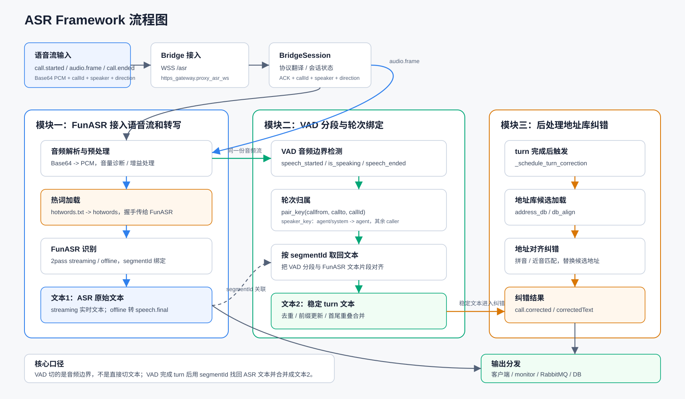

# 接警机器人 ASR 全流程服务

面向接警、问询等实时通话场景的 ASR 服务。系统接收带有通话元数据的 PCM 音频流，完成语音识别、VAD 分段、录音绑定、热词增强和地址库纠错，再将结果通过 WebSocket、RabbitMQ、消息服务和 PostgreSQL 分发给下游。



## 核心流程

```text
来电音频
  -> WSS /asr（Bridge 协议、逐帧 ACK）
  -> 音频预处理与 VAD
  -> FunASR / 可选讯飞方言识别
  -> speech.final
  -> 录音切分与文本绑定
  -> 地址库对齐纠错 / 规则或 LLM 高亮
  -> /monitor + RabbitMQ + 消息服务 + PostgreSQL
  -> ASR 纠正文本
```

项目按业务职责分为三个核心模块：

| 模块 | 职责 | 主要输入 | 主要输出 |
| --- | --- | --- | --- |
| 实时 ASR 接入与分发 | 接收音频、桥接识别引擎、ACK 与结果分发 | `call.started`、`audio.frame`、`call.ended` | `speech.final`、RabbitMQ 消息、数据库记录 |
| VAD 分段与录音绑定 | 检测语音边界、合并业务轮次、保存并绑定录音 | PCM 音频、speaker/direction 元数据 | `speech.vad`、`audio.segment`、WAV 地址 |
| 地址库后处理 | 按地址候选库修正近音字、楼栋和房号等识别错误 | 稳定 ASR 文本、callId、segmentId | `call.corrected`、correctedText、replacements |

完整字段、示例和错误码见 [ASR 三模块 API 接口文档](./ASR三模块API接口文档.md)。

## 主要能力

- 统一 Bridge WebSocket 协议，使用 `callId + segmentId` 关联通话、文本和录音。
- 支持 16 kHz、单声道、`pcm_s16le` 实时音频以及逐帧 ACK。
- 支持 FunASR 2-pass、全量热词、场景动态热词和地址范围动态热词。
- 内置 WebRTC VAD、轮次合并、WAV 持久化及远程录音服务适配。
- 支持地址库对齐纠错、规则高亮和可选 LLM 后处理，后处理失败不阻塞 ASR 主链路。
- 支持监控 WebSocket、RabbitMQ、消息服务和 PostgreSQL 多通道分发。
- 提供实时监控、热词对比、方言评测和 A/E 准确率对比页面。
- 提供 Docker Compose 部署、测试客户端和 300 余项自动化测试。

## 目录结构

```text
.
├── https_gateway.py              # HTTPS/WSS 网关与 HTTP API
├── asr_bridge.py                 # Bridge 协议、会话、VAD 和事件编排
├── asr_providers.py              # FunASR / 讯飞识别适配
├── vad_engine.py                 # VAD 状态机
├── recording_store.py            # 本地/远程录音存储
├── turn_recording_coordinator.py # 文本与录音轮次绑定
├── asr_address_*.py              # 地址库、地址范围与审计
├── asr_ai_postprocessor.py       # 地址纠错与文本高亮
├── asr_rabbitmq.py               # RabbitMQ CloudEvent 分发
├── asr_message_service.py        # 消息服务异步分发
├── funasr_server_xhw.py          # FunASR WebSocket 推理服务
├── core/asr_corrector.py         # 本地热词纠错引擎
├── correction/                   # 纠错索引与关键词映射
├── web/                          # 监控与评测页面
├── hotwords*/                    # 热词与分类资源
├── tests/                        # 自动化测试
├── compose.yaml                  # CPU FunASR + Gateway 编排
└── ASR三模块API接口文档.md       # 对接协议
```

## 快速开始

### 前置条件

- Linux 服务器
- Docker Engine 与 Docker Compose v2
- 已下载的 FunASR Paraformer 模型目录
- 首次构建镜像时可访问 FunASR/ModelScope 镜像源

### 1. 配置

```bash
git clone https://github.com/5wwwjl/asr-api-use.git
cd asr-api-use
cp docker.env.example .env
```

编辑 `.env`，至少设置宿主机上的模型绝对路径：

```dotenv
FUNASR_MODEL_DIR=/absolute/path/to/paraformer-model
```

如需从其他主机访问开发证书，还应设置证书 SAN：

```dotenv
TLS_DNS_NAMES=localhost,asr.example.com
TLS_IP_NAMES=127.0.0.1,10.0.0.10
```

数据库、RabbitMQ、消息服务、讯飞和 LLM 等集成默认关闭；仅在需要时填写对应配置。真实密钥只能保存在本地 `.env` 或部署平台的 Secret 中。

### 2. 构建并启动

```bash
docker compose up -d --build
docker compose ps
docker compose logs -f --tail=100
```

默认入口：

| 地址 | 用途 |
| --- | --- |
| `https://<host>:8443/` | Web 演示与监控页面 |
| `wss://<host>:8443/asr` | 生产 Bridge ASR 接口 |
| `wss://<host>:8443/monitor` | 实时事件订阅 |
| `wss://<host>:8443/asr-cpu-test` | CPU 全链路测试接口 |

首次启动会在 `certs/` 生成自签名证书。生产部署应替换为可信证书，并限制监控、录音和管理接口的访问权限。

更完整的镜像构建、离线迁移和升级说明见 [DOCKER.md](./DOCKER.md)。

### 3. 发送测试音频

安装客户端依赖后，可使用仓库内的 Bridge 测试客户端：

```bash
python -m pip install -r requirements.txt
python bridge_test_client.py ./sample.wav \
  --endpoint wss://127.0.0.1:8443/asr \
  --call-id demo-001 \
  --insecure
```

输入应为 WAV，或使用 `--raw` 发送 16 kHz 单声道 PCM。`--insecure` 仅用于本地自签名证书测试。

## WebSocket 对接

`/asr` 使用业务 Bridge 协议。一次连接的典型顺序如下：

```text
call.started -> audio.frame × N -> call.ended
```

音频帧示例：

```json
{
  "schemaVersion": "1.0",
  "eventId": "evt-call-001-000002",
  "eventType": "audio.frame",
  "callId": "call-001",
  "streamId": "stream-main",
  "seq": 2,
  "timestampMs": 320,
  "payload": {
    "speaker": "caller",
    "direction": "inbound",
    "startTimeMs": 0,
    "endTimeMs": 320,
    "codec": "pcm_s16le",
    "sampleRate": 16000,
    "channels": 1,
    "audioBase64": "<base64-pcm>"
  }
}
```

服务端首先返回 ACK，稳定识别完成后再返回 `speech.final`：

```json
{
  "eventType": "speech.final",
  "callId": "call-001",
  "streamId": "stream-main",
  "seq": 1,
  "payload": {
    "segmentId": "caller-0001",
    "speaker": "caller",
    "direction": "inbound",
    "text": "深圳软件园一期七栋有人被困",
    "confidence": 0.9,
    "language": "zh-CN"
  }
}
```

消费方应以 `callId + segmentId` 聚合 `speech.final`、`audio.segment` 和 `call.corrected`。这些事件由不同异步阶段产生，到达顺序不保证一致。

## 接口一览

| 接口 | 协议 | 说明 |
| --- | --- | --- |
| `/asr` | WSS | Bridge 音频接入、ASR 和完整业务后处理 |
| `/asr-plain` | WSS | 关闭热词的对比入口 |
| `/asr-dynamic` | WSS | 场景动态热词入口 |
| `/asr-cpu-test` | WSS | 独立 CPU 上游的全链路测试入口 |
| `/asr-accuracy-a` | WSS | 原生 FunASR A 组基线，不进入业务后处理 |
| `/monitor` | WSS | 订阅通话、VAD、文本、录音和纠错事件 |
| `/asr/records` | HTTP | 按 callId 查询持久化记录 |
| `/asr/transcripts/{call_id}` | HTTP | 查询指定通话的转写记录 |
| `/recordings/...` | HTTP | 读取本地 WAV 录音 |
| `/audio/{record_id}` | HTTP | 代理远程录音文件 |
| `/cti/events` | HTTP | 接收通话保持/恢复等 CTI 事件 |

管理和演示接口可在 [https_gateway.py](./https_gateway.py) 的 `create_app()` 中查看。正式环境不应将模型切换、审计、原始录音或演示接口直接暴露到公网。

## 本机部署脚本

除 Compose 外，仓库保留了当前 GPU/CPU 混合部署脚本：

- `start_all_services.sh`：启动 GPU 生产模型、GPU A 组基线、CPU 测试模型和 Gateway。
- `start_funasr_docker.sh`：启动 CPU Paraformer 容器。
- `start_funasr_gpu_baseline.sh`：启动 GPU Paraformer A 组基线。
- `switch_accuracy_model.sh`：切换准确率对比模型。
- `watchdog.sh`：检查并守护模型和 Gateway。

这些脚本包含当前服务器的容器名、端口和目录约定，迁移到新机器前必须按部署环境调整。可移植部署优先使用 `compose.yaml`。

## 开发与测试

```bash
python -m pip install -r requirements.txt
python -m py_compile *.py
pytest -q
```

测试默认使用 mock/fake 依赖验证协议、VAD、录音绑定、纠错、数据库和消息分发；依赖本地评测音频的用例会在资产未提供时跳过。真实模型、数据库、RabbitMQ 与外部服务需要单独做集成测试。

## 数据与安全

以下内容属于运行数据或敏感配置，已排除在版本控制之外：

- `.env` 及其备份
- TLS 私钥、证书与外部服务凭据
- 通话录音、评测音频、日志和报告
- 本地模型、快照、缓存和临时文件

提交前建议再次运行凭据扫描，并确认热词、地址库和测试数据符合所在组织的数据发布要求。
